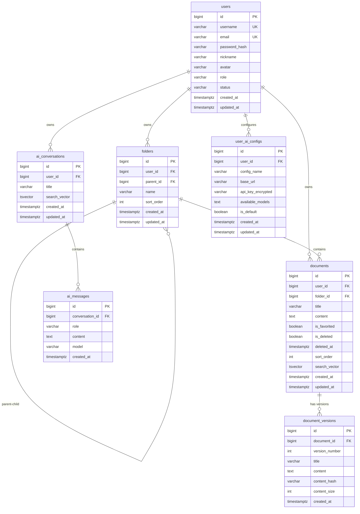

# 数据库设计文档

> Orange Mark Mind 数据库设计 v2.0

## 技术选型

- **数据库**: PostgreSQL 15+
- **缓存**: Redis 7+
- **ORM**: GORM
- **迁移工具**: golang-migrate

## ER 图



---

## 表结构详解

### 1. users (用户表)

存储系统用户的基本信息和认证数据。

| 字段          | 类型         | 约束                       | 说明            |
| :------------ | :----------- | :------------------------- | :-------------- |
| id            | BIGSERIAL    | PK                         | 主键            |
| username      | VARCHAR(50)  | UNIQUE, NOT NULL           | 用户名          |
| email         | VARCHAR(100) | UNIQUE, NOT NULL           | 邮箱            |
| password_hash | VARCHAR(255) | NOT NULL                   | BCrypt 密码哈希 |
| nickname      | VARCHAR(50)  |                            | 显示昵称        |
| avatar        | VARCHAR(255) |                            | 头像 URL        |
| role          | VARCHAR(20)  | NOT NULL, DEFAULT 'user'   | 角色            |
| status        | VARCHAR(20)  | NOT NULL, DEFAULT 'active' | 状态            |
| created_at    | TIMESTAMPTZ  | NOT NULL                   | 创建时间        |
| updated_at    | TIMESTAMPTZ  | NOT NULL                   | 更新时间        |

**角色枚举**: `user`, `admin`
**状态枚举**: `active`, `disabled`

---

### 2. folders (文件夹表)

支持多级嵌套的树形文件夹结构。

| 字段       | 类型         | 约束      | 说明                                 |
| :--------- | :----------- | :-------- | :----------------------------------- |
| id         | BIGSERIAL    | PK        | 主键                                 |
| user_id    | BIGINT       | NOT NULL  | 逻辑外键 → users.id                  |
| parent_id  | BIGINT       |           | 逻辑外键 → folders.id，NULL = 根目录 |
| name       | VARCHAR(100) | NOT NULL  | 文件夹名称                           |
| sort_order | INT          | DEFAULT 0 | 排序顺序                             |
| created_at | TIMESTAMPTZ  | NOT NULL  | 创建时间                             |
| updated_at | TIMESTAMPTZ  | NOT NULL  | 更新时间                             |

---

### 3. documents (文档表)

存储 Markdown 文档，支持收藏和软删除。

| 字段          | 类型         | 约束                    | 说明                     |
| :------------ | :----------- | :---------------------- | :----------------------- |
| id            | BIGSERIAL    | PK                      | 主键                     |
| user_id       | BIGINT       | NOT NULL                | 逻辑外键 → users.id      |
| folder_id     | BIGINT       |                         | 逻辑外键 → folders.id    |
| title         | VARCHAR(200) | NOT NULL                | 标题                     |
| content       | TEXT         |                         | Markdown 内容            |
| is_favorited  | BOOLEAN      | NOT NULL, DEFAULT FALSE | 收藏标记                 |
| is_deleted    | BOOLEAN      | NOT NULL, DEFAULT FALSE | 软删除标记               |
| deleted_at    | TIMESTAMPTZ  |                         | 删除时间                 |
| sort_order    | INT          | DEFAULT 0               | 排序顺序                 |
| search_vector | TSVECTOR     |                         | 全文搜索向量（自动维护） |
| created_at    | TIMESTAMPTZ  | NOT NULL                | 创建时间                 |
| updated_at    | TIMESTAMPTZ  | NOT NULL                | 更新时间                 |

**全文搜索**: 使用 PostgreSQL `tsvector` + GIN 索引，触发器自动更新。

---

### 4. document_versions (文档历史版本表)

存储文档的历史版本，支持版本回溯。

| 字段           | 类型         | 约束      | 说明                    |
| :------------- | :----------- | :-------- | :---------------------- |
| id             | BIGSERIAL    | PK        | 主键                    |
| document_id    | BIGINT       | NOT NULL  | 逻辑外键 → documents.id |
| version_number | INT          | NOT NULL  | 版本号                  |
| title          | VARCHAR(200) | NOT NULL  | 该版本标题              |
| content        | TEXT         |           | 该版本内容              |
| content_hash   | VARCHAR(64)  |           | SHA-256 哈希（去重）    |
| content_size   | INT          | DEFAULT 0 | 内容字节数              |
| created_at     | TIMESTAMPTZ  | NOT NULL  | 版本创建时间            |

---

### 5. ai_conversations (AI 对话会话表)

存储用户的 AI 对话会话。

| 字段          | 类型         | 约束     | 说明                     |
| :------------ | :----------- | :------- | :----------------------- |
| id            | BIGSERIAL    | PK       | 主键                     |
| user_id       | BIGINT       | NOT NULL | 逻辑外键 → users.id      |
| title         | VARCHAR(200) |          | 对话标题                 |
| search_vector | TSVECTOR     |          | 全文搜索向量（自动维护） |
| created_at    | TIMESTAMPTZ  | NOT NULL | 创建时间                 |
| updated_at    | TIMESTAMPTZ  | NOT NULL | 最后消息时间             |

---

### 6. ai_messages (AI 对话消息表)

存储对话中的每条消息，支持同一对话内切换模型。

| 字段            | 类型         | 约束     | 说明                           |
| :-------------- | :----------- | :------- | :----------------------------- |
| id              | BIGSERIAL    | PK       | 主键                           |
| conversation_id | BIGINT       | NOT NULL | 逻辑外键 → ai_conversations.id |
| role            | VARCHAR(20)  | NOT NULL | `user` / `assistant`           |
| content         | TEXT         | NOT NULL | 消息内容                       |
| model           | VARCHAR(100) |          | AI 模型（仅 assistant 有值）   |
| created_at      | TIMESTAMPTZ  | NOT NULL | 发送时间                       |

---

### 7. user_ai_configs (用户 AI 配置表)

存储用户的 API 配置，支持多个提供商。

| 字段              | 类型         | 约束                    | 说明                    |
| :---------------- | :----------- | :---------------------- | :---------------------- |
| id                | BIGSERIAL    | PK                      | 主键                    |
| user_id           | BIGINT       | NOT NULL                | 逻辑外键 → users.id     |
| config_name       | VARCHAR(50)  | NOT NULL                | 配置名称（唯一）        |
| base_url          | VARCHAR(255) | NOT NULL                | API Base URL            |
| api_key_encrypted | VARCHAR(500) | NOT NULL                | AES-256-GCM 加密的 Key  |
| available_models  | TEXT         |                         | JSON 数组，可用模型列表 |
| is_default        | BOOLEAN      | NOT NULL, DEFAULT FALSE | 默认配置                |
| created_at        | TIMESTAMPTZ  | NOT NULL                | 创建时间                |
| updated_at        | TIMESTAMPTZ  | NOT NULL                | 更新时间                |

**唯一约束**: `(user_id, config_name)`

---

## Redis 缓存设计

### Token 管理

| Key                     | 值          | TTL         | 说明             |
| :---------------------- | :---------- | :---------- | :--------------- |
| `rt:{user_id}:{hash}`   | JSON 元数据 | 7d          | Refresh Token    |
| `user:{user_id}:tokens` | SET         | 7d          | 用户所有 RT 索引 |
| `blacklist:at:{hash}`   | 1           | AT 剩余时间 | AT 黑名单        |

### API Key 加密

- **算法**: AES-256-GCM
- **密钥**: 从环境变量 `ENCRYPTION_KEY` 读取
- **存储**: Base64 编码后存入数据库

---

## 索引策略

所有表都已根据查询模式创建了适当的索引：

1. **主键索引**: 自动创建
2. **唯一索引**: username, email, (user_id, config_name)
3. **外键索引**: 所有逻辑外键字段
4. **复合索引**: 常用查询组合
5. **部分索引**: 针对特定条件（如 is_deleted = TRUE）
6. **GIN 索引**: 全文搜索

---

## 迁移文件

```
backend/migrations/
├── 000001_create_users_table.up.sql
├── 000001_create_users_table.down.sql
├── 000002_create_folders_table.up.sql
├── 000002_create_folders_table.down.sql
├── 000003_create_documents_table.up.sql
├── 000003_create_documents_table.down.sql
├── 000004_create_document_versions_table.up.sql
├── 000004_create_document_versions_table.down.sql
├── 000005_create_ai_conversations_table.up.sql
├── 000005_create_ai_conversations_table.down.sql
├── 000006_create_ai_messages_table.up.sql
├── 000006_create_ai_messages_table.down.sql
├── 000007_create_user_ai_configs_table.up.sql
└── 000007_create_user_ai_configs_table.down.sql
```

---

_最后更新: 2026-01-18_
